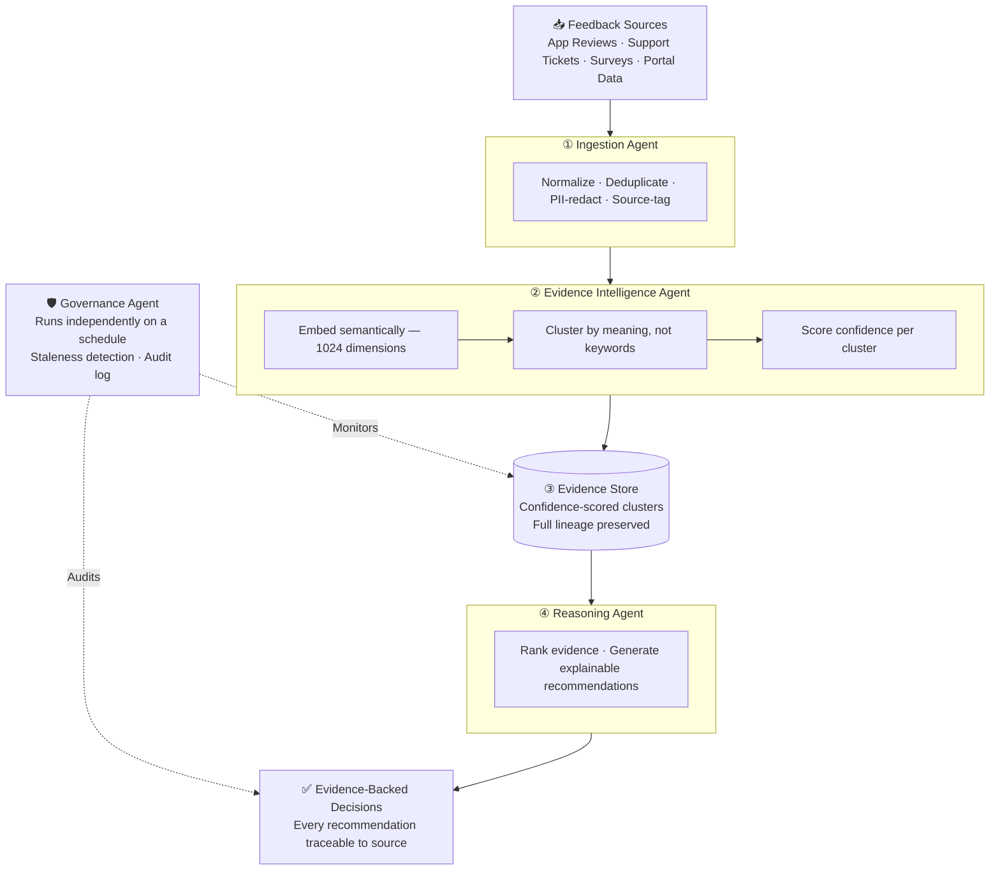
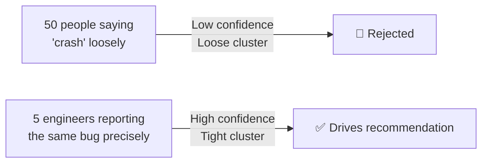

<div align="center">


[](#recognition)
[](https://youtu.be/wEG5jTQxlJ4?si=l1tH72icmjTMdh_H)
[](https://builder.aws.com/content/3AzrKpJbhJwEP6EZbm87vdxufgi/aideas-finalist-veloquity-the-agentic-evidence-intelligent-platform-turning-raw-feedback-into-evidence-driven-decisions)

<br/>


</div>

---

## International Recognition

<a name="recognition"></a>

Veloquity won the **Global AWS 10,000 AIdeas Competition 2026 - Asia Pacific & Japan (APJC) Regional Championship**, selected from 10,000+ teams across 115 countries.

- 🏆 **AWS APJC Regional Champion** — $15,000 prize support · $1,500 AWS credits · AWS re:Invent Las Vegas invitation
- 📰 Full technical write-up: [AWS Builder Center Article](https://builder.aws.com/content/3AzrKpJbhJwEP6EZbm87vdxufgi/aideas-finalist-veloquity-the-agentic-evidence-intelligent-platform-turning-raw-feedback-into-evidence-driven-decisions)
- 🎥 Demo video: [Watch on YouTube](https://youtu.be/wEG5jTQxlJ4?si=l1tH72icmjTMdh_H)
- 📰 Featured in **Business Today** alongside **Jeff Barr** *(Vice President & Chief Evangelist, AWS)*

---

## The Problem

**Organizations today are not lacking feedback. They are lacking clarity.**

Feedback arrives continuously across product teams, hospitals, and public systems — support tickets, app reviews, survey responses, and user complaints. Each signal seems small in isolation. Collectively, they form a pattern. But that pattern is hard to see.

The same underlying issue may arrive described in completely different ways:
- a crash report
- a vague complaint  
- a frustrated review
- a detailed support ticket

Most teams still rely on manual interpretation — reading feedback, scanning tickets, prioritizing based on intuition. At small scale, this works. At large scale, it fails. Organizations may process thousands of inputs yet still miss the single issue affecting the most users.

**Veloquity was built to close that gap.**

---

## What Was Built

A fully serverless, agentic pipeline that transforms raw, unstructured feedback into prioritized, evidence-backed decisions — with every recommendation traceable back to the exact source item that produced it.



| Stage | Job | Core AWS Technology |
|---|---|---|
| Ingestion | Normalize, protect, and deduplicate raw feedback | AWS Lambda · Amazon S3 |
| Evidence Intelligence | Embed and cluster feedback into confidence-scored evidence | Amazon Titan Embed V2 · RDS PostgreSQL (pgvector, HNSW) |
| Reasoning | Reason over evidence into ranked, source-linked recommendations | Amazon Bedrock (Nova Pro) |
| Governance | Detect staleness, promote signals, maintain audit trail | AWS Lambda · Amazon EventBridge |

---

## How It's Different

### Traceability, not a black box

Every recommendation Veloquity produces links back through its evidence to the exact original feedback items — source, timestamp, and context, not just a generated paragraph. If a recommendation can't be traced to real evidence, it isn't surfaced.

```
Raw Feedback  →  Evidence Cluster  →  Confidence Score  →  Reasoning  →  Decision
     ↑______________________________________________↑
                    Full lineage preserved
```

### Confidence scoring, not keyword counting

Evidence isn't ranked by how often a word appears. Related feedback is embedded and grouped semantically, then scored on how tightly the group actually agrees with itself.



Volume doesn't win. Coherence does.

### Agentic reasoning, not static rules

The recommendation step isn't a fixed rulebook. A reasoning agent retrieves the relevant evidence, weighs it against multiple factors — confidence, user count, cross-source corroboration, recency — and generates a structured, explainable recommendation. Consistent across every run. Not hardcoded to any domain.

---

## Validated On

Veloquity's core claim is domain-agnostic intelligence. The same code, unmodified, processes meaningful evidence and recommendations regardless of what kind of feedback it receives.

| Domain | Volume | Result |
|---|---|---|
| SaaS product feedback (app reviews + support tickets) | 547 items | Coherent evidence clusters, ranked recommendations |
| Healthcare patient experience (portal + survey data) | 310 items | Same pipeline, zero code changes |
| **Combined** | **857 items** | **One pipeline. Two unrelated domains.** |

**Performance and cost, measured end-to-end:**

| Metric | Result |
|---|---|
| Full pipeline runtime | ~91 seconds |
| Cost per full run | $0.029 |
| Automated test suite | 158 tests, 100% passing |
| Test suite runtime | 0.72 seconds (fully mocked) |

---

Veloquity is a fully serverless & domain-agnostic multi agent evidence intelligence platform that transforms massive, fragmented customer feedback into prioritized, evidence-backed product decisions. Feedback enters through ingestion, gets embedded via Amazon Titan Embed V2, clustered with pgvector HNSW similarity search, scored by a mathematical confidence formula, and reasoned over by a Amazon Nova Pro ReAct loop — producing ranked recommendations that trace back to every original source item. 

Every recommendation links through confidence-scored clusters to individual raw feedback items via the `evidence_item_map` table, providing full source-to-decision traceability with an immutable governance audit log. The same pipeline processes SaaS product crash reports and hospital patient experience surveys without a single line of code changed.

---

## Why It Is Different

- **Mathematical confidence scoring** — cosine centroid variance, not keyword frequency; tight semantic clusters score near 100%, loosely-related mentions are rejected before reaching the reasoning agent
- **Source-to-decision traceability** — every recommendation traces through `evidence_item_map` to the exact raw feedback item, source system, timestamp, and S3 path that generated it
- **ReAct reasoning loop** — four-step pipeline: retrieve evidence → compute priority scores → build structured prompt → invoke Nova Pro; consistent, parseable, comparable output across every run
- **Append-only governance audit log** — every governance action is permanently recorded; any recommendation from any point in time is fully reproducible and auditable
- **$0.029 per full pipeline run** — embedding + reasoning + governance on 547 items; subsequent runs with cached embeddings cost ~$0.013
- **Domain-agnostic pipeline** — zero hardcoded product or domain vocabulary; same Lambda code runs on software product feedback and hospital patient surveys without modification

---

## Architecture

```
Raw User Feedback
     │
     ▼
┌─────────────────────┐
│  Ingestion Agent    │  PII redaction · SHA-256 dedup · S3 write
└─────────────────────┘
     │
     ▼
┌─────────────────────┐
│ Evidence Intel Agent│  Titan Embed V2 · pgvector HNSW · confidence scoring
└─────────────────────┘
     │
     ▼
┌─────────────────────┐
│  Reasoning Agent    │  Priority formula · Amazon Nova Pro ReAct · ranked recommendations with full source-to-decision traceability
└─────────────────────┘
     │
     ▼
┌─────────────────────┐
│  Governance Agent   │  Stale detection · signal promotion · immutable audit log
└─────────────────────┘
     │
     ▼
  Product Manager Decision
```

```
┌──────────────────────────────────────────────────────────────┐
│                     VELOQUITY PIPELINE                       │
├─────────────┬─────────────┬──────────────┬───────────────────┤
│ Ingestion   │ Evidence    │ Reasoning    │ Governance        │
│ Lambda      │ Lambda      │ Lambda       │ Lambda            │
│             │             │              │                   │
│ PII strip   │ Titan       │ Nova Pro     │ Stale detection   │
│ SHA-256     │ Embed V2    │ ReAct loop   │ Signal promotion  │
│ dedup       │ pgvector    │ Priority     │ Audit log         │
│ S3 write    │ HNSW        │ scoring      │ EventBridge daily │
└─────────────┴─────────────┴──────────────┴───────────────────┘
        ↕                          ↕
RDS PostgreSQL              Amazon S3
pgvector 1024-dim           Raw feedback
8 SQL migrations            JSON store
        ↕
FastAPI on Render
        ↕
React on Vercel
```
---

## Confidence Scoring

```
distance_i = 1 - cosine_similarity(item_vector, centroid)
variance   = mean(distance_i for all cluster members)
confidence = clamp(1.0 - variance x 2.0, 0.0, 1.0)
```

Routing bands:
```
score < 0.40  →  auto-reject  (no LLM cost)
score < 0.60  →  LLM validation via Nova Pro
score >= 0.60 →  auto-accept
```

---

## Priority Scoring

```
priority = confidence x 0.35
         + users x 0.25
         + corroboration x 0.20
         + recency x 0.20

corroboration_bonus = +0.10 if sources > 1
user_score          = min(unique_users / 50, 1.0)
recency_score       = max(0, 1 - days_since_validated / 90)
```

---

## Domain Applications

Veloquity is domain-agnostic. The same pipeline processes completely different kinds of feedback without code changes.

**Software Product Teams** — 547 items · 6 clusters · App Store Reviews + Support Tickets Tickets

Six evidence clusters identified: app crashes on project switch (91% conf, 94 users), black screen after latest update (87%, 78 users), dashboard load regression (86%, 71 users), no onboarding checklist (81%, 63 users), export to CSV silently fails (77%, 54 users), notification delay on mobile (72%, 48 users). The Reasoning Agent identified that clusters 1 and 2 share a root cause and recommended a single P0 hotfix.

**Healthcare and Hospital Operations** — 310 items · 4 clusters · Patient Portal + Hospital Survey

Four evidence clusters identified: extended emergency wait times (91% conf, 87 patients, rising trend), online appointment booking failures (84%, 71 patients), billing statement errors and confusion (78%, 58 patients), medical records portal access issues (72%, 44 patients, decreasing). Same pipeline, same confidence formula, same reasoning agent. Zero code changes.

Other applicable domains: **e-commerce** (product quality, checkout friction, returns) · **financial services** (fee disputes, mobile deposit failures, loan process) · **hospitality** (room maintenance, check-in friction, amenity expectations) · **education** (content quality, assessment clarity, support response time)

---

## Tech Stack

**Backend and Infrastructure**

Python · FastAPI · PostgreSQL 16 + pgvector · AWS Lambda x4 · Amazon Bedrock Nova Pro · Amazon Titan Embed V2 · S3 · EventBridge · CloudFormation · Secrets Manager · IAM · Render

**Frontend**

React 18 · TypeScript · Vite · Tailwind CSS · Framer Motion · Recharts · Radix UI · Vercel

---

## AWS Services

| Service | Role in Veloquity |
|---|---|
| AWS Lambda | Hosts all four pipeline agents |
| Amazon Bedrock — Nova Pro | Reasoning and recommendation generation |
| Amazon Bedrock — Titan Embed V2 | 1024-dimensional semantic embeddings |
| Amazon RDS (PostgreSQL + pgvector) | HNSW vector search and relational storage |
| Amazon S3 | Feedback storage and reasoning run archival |
| Amazon EventBridge | Scheduled governance triggers |
| AWS IAM | Access control across all services |
| AWS Secrets Manager | Credential management — nothing hardcoded |

---

## Project Structure

```
veloquity/
├── api/              FastAPI backend, 5 route modules
├── ingestion/        Ingestion Lambda, PII strip, dedup, S3
├── evidence/         Evidence Lambda, embeddings, clustering
├── reasoning/        Reasoning Lambda, ReAct loop, Nova Pro
├── governance/       Governance Lambda, daily maintenance
├── lambda_reasoning/ Lambda entry point wrapper
├── frontend_final/   React frontend, 10 pages
├── db/migrations/    8 SQL migrations, pgvector schema
├── infra/            CloudFormation and deploy scripts
└── tests/            158 automated tests, 0.72s runtime
```

---

## Key Design Decisions

**pgvector over Pinecone** — collocated with relational data, zero extra service, HNSW at 1024 dimensions stays sub-10ms to 100K vectors

**Nova Pro over Claude** — AISPL accounts cannot access Anthropic models on Bedrock; Nova Pro is first-party AWS and available universally

**Append-only governance log** — immutable audit trail means recommendations are traceable across time with no delete risk

**Embedding cache** — re-runs on unchanged corpus cost near zero; cache hit rate monitored with configurable alert threshold

**Domain-agnostic pipeline** — zero hardcoded product or domain vocabulary; same Lambda code handles SaaS feedback and hospital patient surveys

---

## Validation Details

```
158 automated tests · 0 failures · 0.72s runtime

Test modules:
test_ingestion.py          33 tests  PII, dedup, normalization, S3, handler
test_embedding_pipeline.py 33 tests  Bedrock cache, clustering, confidence, routing
test_evidence_item_map.py  39 tests  S3 keys, lineage, quotes, write operations
test_governance.py         25 tests  Audit log, stale detection, promotion, cost monitor
test_reasoning_agent.py    28 tests  Fetch, priority scoring, prompt, write, full run

```

---

## Real Failure Modes Encountered and Fixed

Every production failure below was real, encountered during build, and resolved:

**AISPL Payment Restriction** — Anthropic Claude models unavailable for Indian AWS accounts. Switched entire pipeline to Amazon Nova Pro with updated request format (inferenceConfig, system as list, content as list).

**VPC Blocking Bedrock** — Lambda inside VPC could not reach Bedrock API without NAT or VPC endpoint. Removed VpcConfig from Evidence Lambda; RDS uses public endpoint for MVP.

**Lambda Handler Mismatch** — Handler path in CloudFormation pointed to wrong function. Corrected to evidence.embedding_pipeline.handler.

**Missing python-multipart** — FastAPI file upload returned HTTP 422 silently. Added to requirements.txt.

**Lambda Cold Start Latency** — Evidence Lambda loaded a 254MB ML dependency stack (numpy/scipy/scikit-learn/hdbscan) at module init on every cold start. Fixed with lazy imports (loaded only when clustering runs), `is_warmup` guards on all 4 Lambda handlers, and 8 EventBridge keep-warm rules pinging every 5 minutes. `deploy.sh` now force-updates Lambda code after every CloudFormation deploy.

---

